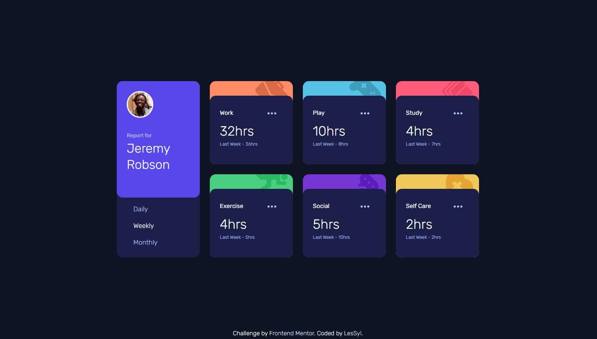
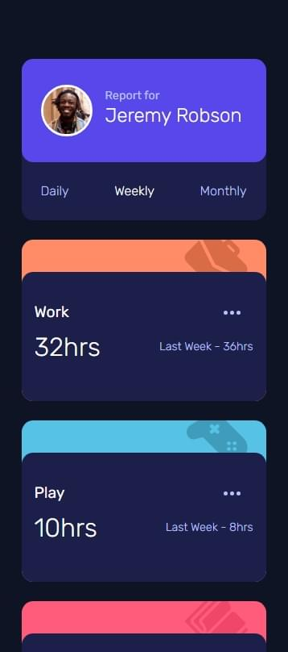
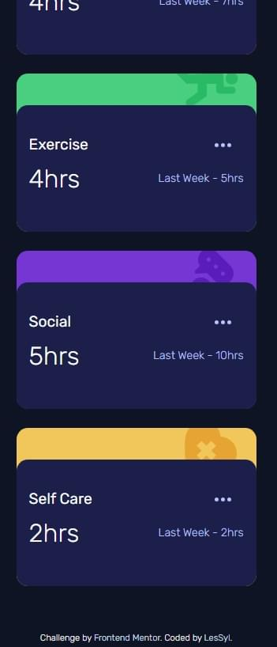

# Frontend Mentor - Time tracking dashboard solution

This is a solution to the [Time tracking dashboard challenge on Frontend Mentor](https://www.frontendmentor.io/challenges/time-tracking-dashboard-UIQ7167Jw). Frontend Mentor challenges help you improve your coding skills by building realistic projects. 

## Table of contents
- [Overview](#overview)
  - [Screenshot](#screenshot)
  - [Links](#links)
- [My process](#my-process)
  - [Built with](#built-with)
  - [What I learned](#what-i-learned)
- [Author](#author)

## Overview

### Screenshot

Desktop

Mobile

### Links

- Repository URL:[GitHub](https://github.com/LesSyl/Time-tracking-dashboard)
- Solution URL: [Frontendmentor]()
- Live Site URL: [Live](https://lessyl.github.io/Time-tracking-dashboard/)
## My process

### Built with

- Semantic HTML5 markup
- Mobile-first workflow
- Sass
- BEM
- Flexbox
- Grid
- JS
- kit
- JSON
- Fetch

### What I learned

My first project with data retrieval was an extremely inspiring and educational experience for me. I learned how to work with the JSON format, which proved to be crucial in uploading and storing data in a structured and readable way. I also learned how to retrieve data from the server. One of the most important topics I mastered was asynchronous functionality, which allows me to effectively manage background operations without blocking the operation of other functions. I also understood how fetch works, which enabled me to fetch and upload data in a simple and efficient way. This project was a great introduction to working with APIs and has significantly enhanced my programming skills.

## Author

- Frontend Mentor - [@LesSyl](https://www.frontendmentor.io/profile/LesSyl)
- gitHub - [@LesSyl](https://github.com/LesSyl)